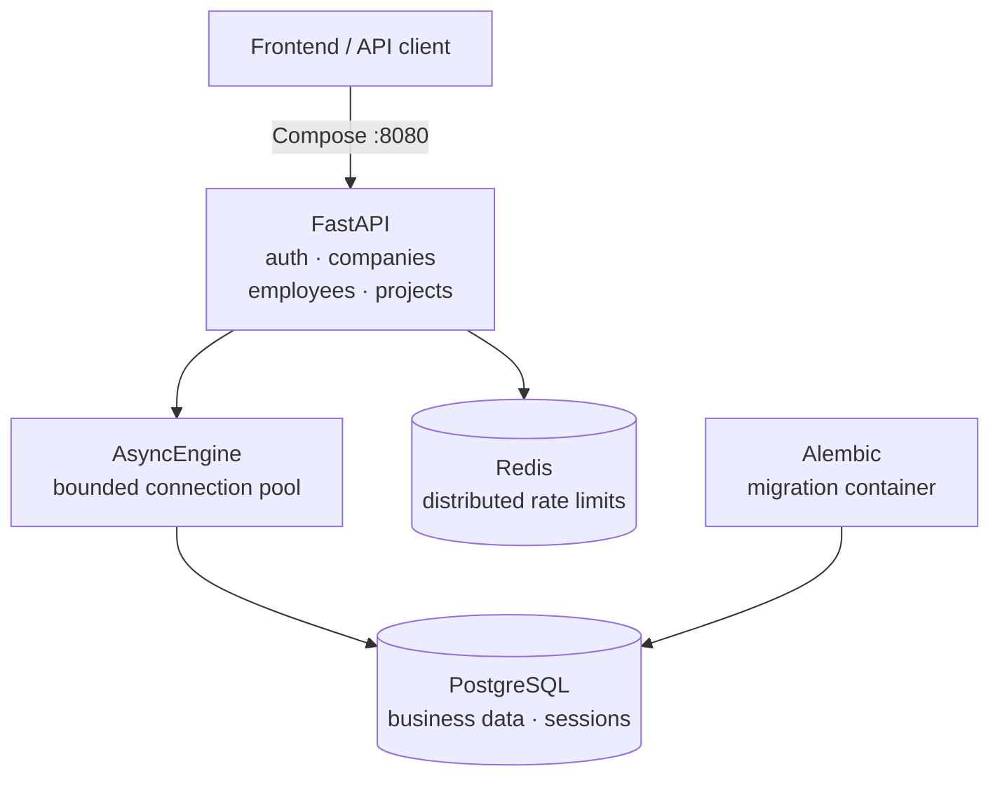
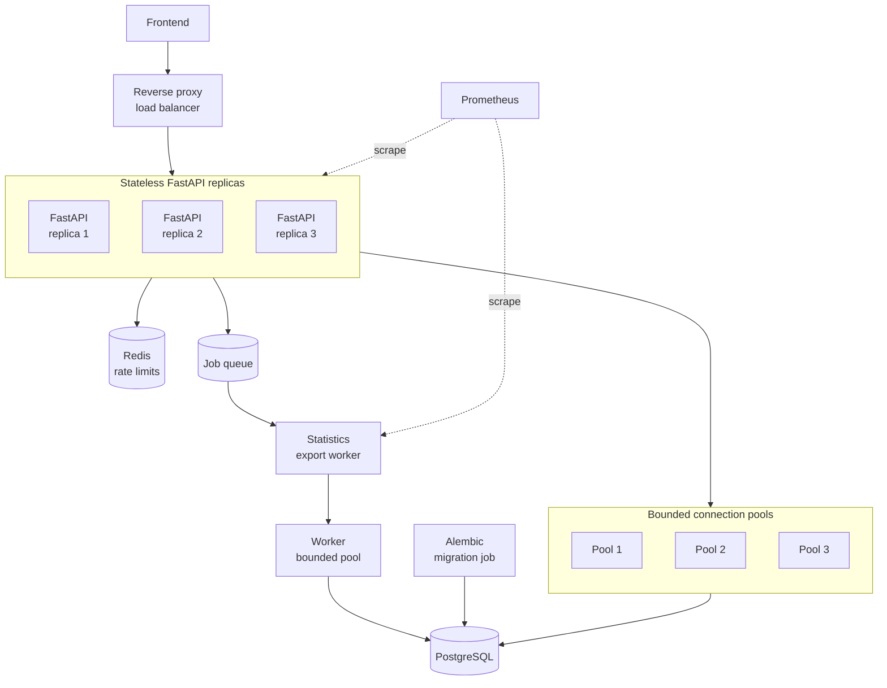

# Company Management API

A FastAPI REST API CRUD of companies, employees, projects, access roles, and project assignments. One deployable stateless unit now, replicas when load grows. Infra is ready for scaling and adding statistics workers without refactors.

## Run

Copy `.env.sample` to `.env`, then run:

```bash
docker compose up -d --build
docker compose exec api python -m scripts.seed_demo
```

Compose starts PostgreSQL and Redis, applies Alembic migrations, and starts the API on port `8080`.

[API](http://localhost:8080/api/v1) · [OpenAPI](http://localhost:8080/docs)

## Test

Minimal unit tests already exist and are ran on every push/pull by GitHub CI.
To test manually, from `http://localhost:8080/docs` open `POST /api/v1/auth/login` handler and add headers:
```text
X-CSRF-Protection: 1
Origin: http://localhost:8080
```
and body
```text
{
  "login": "owner@demo.example",
  "password": "demo-password-123"
}
```
Execute. Take csrf_token from responce and add it for handlers with header `X-CSRF-Token`.

## Current Architecture



## Possible Production Architecture




### Architectural decisions

| Decision | Why it matters |
|---|---|
| **Feature-oriented modular monolith** | Boundaries stay explicit, easier to migrate to microservice architecture if needed. |
| **Onion-style layers** | Responcibilities are diversed, easier to change/rework something. |
| **Tenant safety** | Tenant queries start with `company_id`; makes cross-company project assignments impossible even if application checks are bypassed in some unexpected way. |
| **Authorization model with CSRF** | Sessions in Postgres, HttpOnly cookies, CSRF protection, and `owner` / `admin` / `viewer` roles to protect every business operation. Decided to not use JWT, as cookie-based option is simpler for a module.|
| **Transactional consistency** | One `AsyncSession` and one Unit of Work per use case for atomic DB operations. |
| **Scale-oriented API contracts** | Signed cursor pagination to avoid large offsets and `COUNT(*)`; tenant-leading composite indexes and bounded connection pools to keep query and connection costs predictable. |
| **Controlled DB schema delivery** | Migration is automatic (Alembic) and is done via separate contaner before the API starts |
| **Stateless deployment** | Sessions are in Postgres, rate-limit state is in Redis, so API replicas can be started pretty mush as is.
| **General infra** | Health endpoints, structured logs, request IDs, Prometheus-compatible metrics |

The `10,000,000`-user requirement is treated as a long-term overall amount of users, not as a claim of ten million concurrent users.

## Measurements

Measured on 2026-09-22 with Docker Desktop (4 shared CPUs, 4 GiB) using one Uvicorn process. These are local experiments for general understanding, not production capacity.

| Scenario | HTTP requests | HTTP req/s | p50 | p95 | p99 | Failures / dropped |
|---|---:|---:|---:|---:|---:|---:|
| Login | 10 | 13.25 | 129.56 ms | 200.88 ms | 201.47 ms | 0% / 0 |
| Companies | 3,001 | 99.54 | 6.02 ms | 10.03 ms | 165.41 ms | 0% / 0 |
| Employees | 4,950 | 164.24 | 11.39 ms | 55.49 ms | 185.28 ms | 0% / 0 |
| Projects | 1,263 | 41.89 | 8.10 ms | 10.54 ms | 13.10 ms | 0% / 0 |
| Assignments | 1,505 | 49.87 | 7.66 ms | 10.11 ms | 11.85 ms | 0% / 0 |
| Mixed baseline | 6,900 | 114.48 | 7.16 ms | 10.08 ms | 12.18 ms | 0% / 0 |
| Mixed overload | 6,621 | 213.22 | 548.20 ms | 1,828.38 ms | 2,815.55 ms | 0% / 244 |

Run context: individual business scenarios ran for 30 seconds; mixed baseline ran for 60 seconds with 6,000 iterations; mixed overload ran for 30 seconds with a 250-VU limit; login used 10 requests across 2 VUs. Saturation ran for 50 seconds with a 500-VU limit.

The fixture contained 100,000 accounts, 1,000,000 employees, and 3,000,000 assignments/

Detailed methodology, caveats, scenario results, saturation curves, runtime pool metrics, and query plans: [performance evidence](docs/performance.md), [scenario results](docs/benchmarks/results.md), [saturation curve](docs/benchmarks/saturation-curve.md), [runtime metrics](docs/benchmarks/runtime-metrics.json), and [query plans](docs/benchmarks/query-plans.json).
