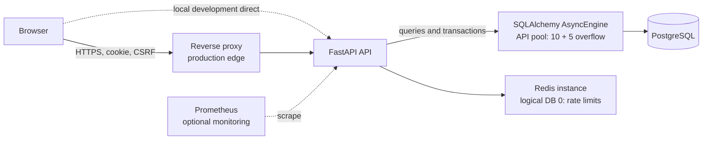
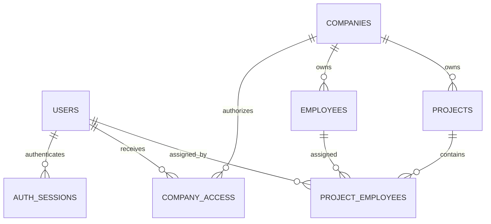

# Backend-дизайн и план реализации Company Management API

Проверка версий и статуса библиотек выполнена по официальным источникам на 22 сентября 2026 года. План исходит из greenfield-репозитория по описанию пользователя; фактическое содержимое репозитория не используется как предпосылка и отдельно не проверялось.

## 1. Scope, assumptions, and workload model

### Назначение первой версии

Backend представляет собой модульный монолит с REST API `/api/v1` для:

- локальной аутентификации глобальных application accounts;
- компаний и управления доступом к ним;
- employee records, не связанных с application accounts;
- проектов и назначений сотрудников;
- административного управления accounts через защищённые operational scripts.

Frontend, SSO, публичная регистрация, приглашения, email-процессы, payroll, файловые экспорты, application cache, database replicas, sharding и микросервисы не входят в backend v1.

### Принятые допущения

- Account login — глобально уникальный email-подобный идентификатор `login`; он не связан с `employees.work_email`.
- Employee work email, если задан, уникален только внутри компании; `work_email_normalized` строится через NFKC, trim и casefold.
- Компания всегда имеет ровно одного `owner`.
- Для перевода ownership новый owner уже должен иметь `admin` или `viewer` access.
- Увольнение employee удаляет активные project assignments в той же транзакции. История назначений отдельно не хранится.
- `completed` и `cancelled` projects сохраняют существующие assignments, но не принимают новые.
- Project status transitions are explicit: `planned -> active|cancelled`, `active -> completed|cancelled`; `completed` and `cancelled` are terminal, and repeating the same status is idempotent.
- Компания, employee и project удаляются физически. Историческое архивирование можно добавить позднее как отдельный use case.
- Provisioned owner account нельзя деактивировать, пока ownership не передан.
- Production topology по умолчанию: frontend и `/api` опубликованы через один HTTPS origin.

Фоновый worker не входит в первую версию: все предусмотренные use cases выполняются синхронно через API и PostgreSQL. Архитектура сохраняет отдельную границу процесса, чтобы позднее добавить `app/workers/` и очередь для действительно долгих операций без изменения CRUD-контрактов. До появления такой операции queue, job tables, worker process и worker container в план не входят.

### Модель нагрузки

`10_000_000 potential users` трактуется как долгосрочная cardinality accounts, а не обещание обслуживать десять миллионов одновременных пользователей.
Для take-home демонстрации достаточно 100–1 000 provisioned accounts; этот диапазон относится к объёму данных, а не к одновременному трафику.

| Показатель | Долгосрочное допущение |
|---|---:|
| Provisioned application accounts | 10 000 000 |
| Daily active users | 500 000 |
| Одновременные активные пользователи | 10 000 |
| Средняя / пиковая нагрузка | 300 / 1 500 RPS |
| Read/write ratio | 85% / 15% |
| Companies | 2 000 000 |
| `company_access` rows | 15 000 000 |
| Employees | 50 000 000 |
| Projects | 10 000 000 |
| `project_employees` rows | 150 000 000 |
| Active sessions | около 1 000 000 |
| Tenant skew | median 10 employees, p99 5 000, максимум около 100 000 |

Следствия:

- только cursor pagination, без обязательного `COUNT(*)`;
- все tenant queries начинаются с `company_id`;
- критические списки имеют covering-compatible composite indexes;
- session lookup выполняется на каждый authenticated request;
- transient/history rows очищаются по retention;
- крупные tenants отдельно входят в load и query-plan tests.

Начальное развертывание — один API container, один PostgreSQL и один Redis. Оно предназначено для демонстрации и измерения базового профиля, а не считается доказательством поддержки указанной долгосрочной нагрузки.

Допустимый путь развития:

1. измерение запросов и улучшение SQL/indexes;
2. увеличение ресурсов PostgreSQL;
3. несколько stateless API replicas за load balancer;
4. контроль connection budget и PgBouncer при подтвержденной необходимости;
5. managed PostgreSQL и Redis;
6. retention/архивирование transient data;
7. partitioning только после измерений поведения больших таблиц.

Database replication и sharding остаются вне этого плана.

---

## 2. Architecture, module responsibilities, and request flow

### Архитектурный стиль

Используется Onion architecture внутри feature-oriented modular monolith.

- **Presentation:** FastAPI handlers, HTTP schemas, dependencies, cookies, headers, Problem Details.
- **Application:** use cases, authorization decisions, pagination, orchestration и вызовы concrete Unit of Work.
- **Domain:** роли, статусы, invariants и domain errors без зависимости от FastAPI/SQLAlchemy.
- **Infrastructure:** targeted repositories, ORM models, concrete Unit of Work, PostgreSQL, Redis, logging и metrics.

Не создаются:

- universal `GenericRepository`;
- interface для каждого класса;
- отдельная domain entity, полностью копирующая ORM model;
- service/repository методы, которые только перенаправляют вызов;
- общий policy engine.

Repository создается только там, где он инкапсулирует tenant scoping, сложный query, lock или persistence contract.

`app/infrastructure/unit_of_work.py` содержит один concrete `SqlAlchemyUnitOfWork`. Он получает process-local `async_sessionmaker`, создает ровно один `AsyncSession` на request/use case и предоставляет feature-specific repositories, привязанные к этому session. `commit`, rollback и close находятся в одном месте. Отдельный abstract UOW interface и generic repository не вводятся: в проекте есть один PostgreSQL adapter, поэтому дополнительная абстракция не дает практической пользы.

### Процессы



Это conceptual topology, а не перечень обязательных local Compose services.

- В production browser идет через `Proxy`, который выполняет reverse-proxy функции, TLS termination и routing.
- В local development frontend может обращаться к `http://localhost:8080` напрямую; отдельный proxy не требуется.
- `Prometheus` находится вне request path и является optional monitoring component. API не должен зависеть от его доступности.
- `RL` — Redis-служба для распределённого rate limiting. В production её можно заменить на managed endpoint.
- `APIPool` находится внутри API process и показывает, где применяется SQLAlchemy connection pool.

### Stateless API

API container не хранит durable state:

- authentication sessions находятся в PostgreSQL;
- rate-limit counters находятся в Redis;
- временные данные процесса исчезают при перезапуске;
- sticky sessions не требуются;
- container-local filesystem не используется как business storage.

### Request flow

1. Outer `CORSMiddleware` обрабатывает preflight и добавляет CORS headers.
2. Trusted host, request-size и request-ID middleware проверяют transport contract.
3. Rate-limit dependency атомарно проверяет нужные Redis limits.
4. `SessionAuthenticator` hash-ирует cookie и читает session вместе с active user.
5. Unsafe request проходит Origin/Referer и CSRF validation.
6. Handler валидирует explicit request schema.
7. Use case проверяет company access и роль.
8. Repository выполняет tenant-scoped query.
9. Use case выполняется через один `SqlAlchemyUnitOfWork`; mutation фиксируется одной короткой PostgreSQL transaction.
10. Response formatter возвращает schema, `ETag`, rate-limit headers и correlation ID.

Каждый API process создает ровно один `AsyncEngine` и одну `async_sessionmaker`. Один `AsyncSession` никогда не используется конкурентными tasks.

---

## 3. Technology decision table with verified sources and trade-offs

| Область | Зафиксированный выбор | Причина и ограничения |
|---|---|---|
| Runtime | **CPython 3.13.12** | Версия runtime фиксируется отдельно от Python-зависимостей. Она должна быть одинаковой локально, в CI и в Docker. [Python releases](https://www.python.org/downloads/), [official Python image tags](https://hub.docker.com/_/python/tags) |
| API | **FastAPI**, **Uvicorn** | Async HTTP API и ASGI deployment. `uv` разрешает актуальные совместимые версии, а тесты подтверждают итоговую комбинацию. [FastAPI async](https://fastapi.tiangolo.com/async/), [Uvicorn documentation](https://www.uvicorn.org/) |
| ORM | **SQLAlchemy 2.x** с `sqlalchemy[asyncio]` | AsyncEngine/AsyncSession; один session нельзя разделять между concurrent tasks; implicit lazy I/O исключается. [SQLAlchemy 2.0](https://docs.sqlalchemy.org/en/20/), [asyncio extension](https://docs.sqlalchemy.org/en/20/orm/extensions/asyncio.html) |
| PostgreSQL driver | **asyncpg** | Native async PostgreSQL driver для SQLAlchemy URL `postgresql+asyncpg`. Alembic использует AsyncEngine и официальный `run_sync` recipe. [asyncpg](https://magicstack.github.io/asyncpg/current/), [SQLAlchemy asyncpg dialect](https://docs.sqlalchemy.org/en/20/dialects/postgresql.html#asyncpg), [Alembic asyncio recipe](https://alembic.sqlalchemy.org/en/latest/cookbook.html#using-asyncio-with-alembic) |
| Database | **PostgreSQL 18.6** | Версия Docker image фиксируется явно для одинаковой local/CI среды. [PostgreSQL versioning](https://www.postgresql.org/support/versioning/), [18.6 release notes](https://www.postgresql.org/docs/release/18.6/), [official image tags](https://hub.docker.com/_/postgres/tags) |
| Migrations | **Alembic** | Schema management остается единственным через Alembic; async engine используется через `run_sync`. [Alembic](https://alembic.sqlalchemy.org/en/latest/front.html) |
| Validation/config | **Pydantic**, **pydantic-settings** | Settings валидирует origins, production security flags и secrets при startup. [Pydantic](https://docs.pydantic.dev/latest/), [pydantic-settings](https://docs.pydantic.dev/latest/concepts/pydantic_settings/) |
| Password hashing | **argon2-cffi** | Argon2id, `check_needs_rehash`; hashing/verification выносятся из event loop и ограничиваются concurrency limiter. [argon2-cffi](https://argon2-cffi.readthedocs.io/en/stable/api.html), [RFC 9106](https://www.rfc-editor.org/rfc/rfc9106.html#section-4) |
| Redis server | **Redis 8.10.2** | Docker image фиксируется явно; используются AOF+RDB и `noeviction`. [Redis release notes](https://redis.io/docs/latest/operate/oss_and_stack/management/persistence/), [official image tags](https://github.com/docker-library/official-images/blob/master/library/redis) |
| Redis client | **redis** | Используется встроенный async API `redis.asyncio`; отдельный `hiredis` dependency не добавляется. [redis-py async client](https://redis.io/docs/latest/develop/clients/redis-py/async/) |
| Rate limiting | **limits** + direct **redis** | Используются `limits.aio.storage.RedisStorage(implementation="redispy")` и `limits.aio.strategies.SlidingWindowCounterRateLimiter`; direct `redis` dependency предоставляет async client, поэтому `limits[async-redis]`, `coredis` и `hiredis` не добавляются. `aiolimiter` не используется вместо distributed limiter. [limits](https://limits.readthedocs.io/en/stable/), [async support](https://limits.readthedocs.io/en/stable/async.html) |
| Logs/metrics | **structlog**, **prometheus-client** | JSON logs с contextvars и Prometheus-compatible metrics. [structlog](https://www.structlog.org/en/stable/), [prometheus-client](https://prometheus.github.io/client_python/) |
| Dependency management | **uv**, committed `uv.lock` | Проект создается через `uv init`; runtime dependencies добавляются именами через `uv add`, test tools — через `uv add --dev`; версии вручную не фиксируются, resolver выбирает актуальные совместимые releases, а lock сохраняет фактическую комбинацию. Обновление выполняется явно через `uv lock --upgrade`, а не скрыто при каждом запуске. [uv projects](https://docs.astral.sh/uv/concepts/projects/), [uv lockfile](https://docs.astral.sh/uv/concepts/projects/layout/#the-lockfile) |
| Tests | **pytest**, **pytest-asyncio**, **HTTPX**, **Polyfactory**, **testcontainers** | Async API tests, real PostgreSQL/Redis и SQLAlchemy async factories. Итоговая комбинация зависимостей проверяется CI. [HTTPX transports](https://www.python-httpx.org/advanced/transports/), [Polyfactory SQLAlchemy](https://polyfactory.litestar.dev/latest/usage/library_factories/sqlalchemy_factory.html), [testcontainers](https://testcontainers.com/guides/getting-started-with-testcontainers-for-python/) |
| Quality | **Ruff** | Ruff используется для linting и formatting. SQLAlchemy annotations оформляются через `Mapped`/`mapped_column`. [Ruff](https://docs.astral.sh/ruff/), [SQLAlchemy typing](https://docs.sqlalchemy.org/en/20/tutorial/metadata.html#orm-declarative-forms) |
| Load test | **k6** | Scenarios, cookies, thresholds и независимость от Python event loop. [k6 scenarios](https://grafana.com/docs/k6/latest/using-k6/scenarios/), [thresholds](https://grafana.com/docs/k6/latest/using-k6/thresholds/) |

Docker images фиксируются выбранными tags: `python:3.13.12-slim`, `postgres:18.6`, `redis:8.10.2`. На этапе Docker setup выполняется `docker pull` и smoke test этих tags.

---

## 4. Proposed directory tree and package responsibilities

```text
.
├── pyproject.toml
├── uv.lock
├── alembic.ini
├── Dockerfile
├── docker-compose.yaml
├── .gitignore
├── .dockerignore
├── .env.example
├── README.md
├── app/
│   ├── __init__.py
│   ├── main.py
│   ├── config.py
│   ├── exceptions/
│   │   ├── __init__.py
│   │   ├── base.py
│   │   ├── auth.py
│   │   ├── authorization.py
│   │   └── conflicts.py
│   ├── handlers/
│   │   ├── __init__.py
│   │   ├── dependencies.py
│   │   ├── errors.py
│   │   └── middleware.py
│   ├── infrastructure/
│   │   ├── __init__.py
│   │   ├── database.py
│   │   ├── unit_of_work.py
│   │   ├── redis.py
│   │   ├── rate_limit.py
│   │   ├── logging.py
│   │   ├── metrics.py
│   │   └── orm/
│   │       ├── __init__.py
│   │       ├── base.py
│   │       └── mixins.py
│   ├── utils/
│   │   ├── __init__.py
│   │   ├── cursor.py
│   │   ├── normalization.py
│   │   └── security.py
│   ├── auth/
│   │   ├── __init__.py
│   │   ├── domain.py
│   │   ├── models.py
│   │   ├── schemas.py
│   │   ├── repositories.py
│   │   ├── services.py
│   │   ├── passwords.py
│   │   ├── csrf.py
│   │   └── handlers.py
│   ├── companies/
│   │   ├── __init__.py
│   │   ├── domain.py
│   │   ├── models.py
│   │   ├── schemas.py
│   │   ├── repositories.py
│   │   ├── services.py
│   │   └── handlers.py
│   ├── employees/
│   │   ├── __init__.py
│   │   ├── domain.py
│   │   ├── models.py
│   │   ├── schemas.py
│   │   ├── repositories.py
│   │   ├── services.py
│   │   └── handlers.py
│   └── projects/
│       ├── __init__.py
│       ├── domain.py
│       ├── models.py
│       ├── schemas.py
│       ├── repositories.py
│       ├── services.py
│       └── handlers.py
├── migrations/
│   ├── env.py
│   ├── script.py.mako
│   └── versions/
│       ├── 0001_users_auth_sessions.py
│       ├── 0002_companies_company_access.py
│       └── 0003_employees_projects_assignments.py
├── tests/
│   ├── conftest.py
│   ├── factories.py
│   ├── unit/
│   ├── integration/
│   ├── api/
│   ├── concurrency/
│   └── smoke/
├── docs/
│   ├── performance.md
│   └── openapi.json (generated)
├── docker/
│   └── postgres/
│       └── init/
│           └── 001-create-roles.sh
├── load/
│   └── k6/
│       ├── login.js
│       ├── business_flows.js
│       ├── mixed.js
│       └── saturation.js
└── scripts/
    ├── __init__.py
    ├── generate_load_data.py
    ├── provision_account.py
    ├── reset_password.py
    ├── set_account_status.py
    ├── seed_demo.py
    └── cleanup_sessions.py
```

`app/` — единственный Python package приложения и одновременно source root репозитория. Дополнительный wrapper-каталог `src/` не используется: для take-home проекта это убирает лишний уровень без изменения Onion-разделения. `uvicorn` и operational scripts запускаются из корня репозитория и импортируют `app.*`.

Будущая граница фоновой обработки сохраняется на уровне процесса: при появлении длительной операции можно добавить отдельный entrypoint под `app/workers/` и соответствующий container, не помещая worker-зависимости в HTTP handlers или business services. В текущей версии этот каталог, queue adapter, job repository и worker container не создаются.

Правила зависимостей:

- `domain.py` не импортирует FastAPI, SQLAlchemy или Redis и содержит только инварианты feature.
- `schemas.py` определяет только wire contract: входные и выходные Pydantic-модели.
- `repositories.py` содержит feature-specific SQL, eager-loading и locks; generic repository не вводится.
- `services.py` содержит use cases, authorization checks и transaction intent. Сервис получает зависимости явно и не знает о HTTP.
- `handlers.py` преобразует HTTP в вызовы `services.py`, выбирает status codes и не содержит SQL или бизнес-правил.
- `exceptions/` содержит типизированные ошибки приложения; `handlers/errors.py` переводит их в единый Problem Details response.
- `infrastructure/` содержит database/Redis/ORM/logging/metrics adapters; `utils/` допускается только для небольших переиспользуемых pure helpers (`cursor`, normalization, crypto).
- `infrastructure/unit_of_work.py` содержит concrete `SqlAlchemyUnitOfWork`: один `AsyncSession`, набор feature-specific repositories, явные `commit`/rollback/close. UOW используется на границе use case, а не как скрытая глобальная транзакция.
- `main.py` является единственной точкой сборки FastAPI-приложения; application composition не выделяется в отдельный модуль, а administrative commands остаются независимыми `scripts/*.py`.
- Операционные команды находятся в независимых `scripts/*.py` и повторно используют те же `services.py`, `repositories.py` и `config.py`; demo seed не смешивается с account provisioning.
- Shared ORM mixins сокращают повторение UUID/timestamps/version, но не скрывают tenant rules.
- Между features используются небольшие application contracts, а не прямое обращение к чужим handlers.

---

## 5. Domain model and database schema

### Общие правила

- Domain IDs: application-generated `uuid.uuid4()`, PostgreSQL native `uuid`.
- Instants: `timestamptz`, всегда aware UTC.
- Business dates: PostgreSQL `date`.
- Status/role: `varchar` с `CHECK`, чтобы migration оставалась простой.
- `created_at`: `timestamptz NOT NULL DEFAULT now()`.
- `updated_at`: `timestamptz NOT NULL DEFAULT now()`, явно обновляется use case для mutable business rows.
- `version`: только у `companies`, `employees`, `projects`.
- Имена constraints задаются через SQLAlchemy naming convention.
- Никаких startup `create_all()`.

UUIDv4 занимает 16 bytes против 8 bytes у `bigint`; random distribution ухудшает B-tree locality, увеличивает page splits и размер secondary indexes. Это принимается ради независимой генерации глобально уникальных IDs. Fill factor и index bloat контролируются измерениями. UUID не считается secret и не дает authorization.

### Relationships



### `users`

| Элемент | Определение |
|---|---|
| Columns | `id uuid PK`; `login varchar(254) NOT NULL`; `login_normalized varchar(254) NOT NULL`; `display_name varchar(200) NOT NULL`; `password_hash text NOT NULL`; `is_active boolean NOT NULL DEFAULT true`; `password_changed_at timestamptz NOT NULL`; `created_at`, `updated_at` |
| Constraints | unique `login_normalized`; trimmed/nonempty login/display name |
| FK/delete | Нет employee link. Ссылки из access используют `RESTRICT`; sessions используют `CASCADE`. Публичного user delete нет |
| Indexes | unique index на `login_normalized`; PK достаточно для UUID lookup |

`login_normalized` строится через NFKC, trim и casefold. Совпадение с `employees.work_email` не имеет бизнес-смысла.

### `auth_sessions`

| Элемент | Определение |
|---|---|
| Columns | `id uuid PK`; `user_id uuid NOT NULL`; `token_hash bytea NOT NULL`; `csrf_token bytea NOT NULL`; `created_at timestamptz NOT NULL`; `expires_at timestamptz NOT NULL`; `revoked_at timestamptz NULL` |
| Constraints | unique `token_hash`; `octet_length(token_hash)=32`; `octet_length(csrf_token)=32`; `expires_at>created_at` |
| FK/delete | `user_id -> users.id ON DELETE CASCADE` |
| Indexes | unique token lookup; partial `(user_id, expires_at) WHERE revoked_at IS NULL`; partial `(expires_at) WHERE revoked_at IS NULL` для expired cleanup; partial `(revoked_at) WHERE revoked_at IS NOT NULL` для revoked-session grace cleanup |

`last_seen_at` отсутствует: expiry абсолютный.

### `companies`

| Элемент | Определение |
|---|---|
| Columns | `id uuid PK`; `name varchar(200) NOT NULL`; `description varchar(5000) NULL`; `website varchar(2048) NULL`; `version integer NOT NULL DEFAULT 1`; `created_at`, `updated_at` |
| Constraints | trimmed/nonempty name; `version>0`; company name не global unique |
| Delete | Owner-only hard delete; cascades access, employees, projects и assignments |
| Indexes | PK; list идет через `company_access`, поэтому отдельный `created_at` index не нужен |

### `company_access`

| Элемент | Определение |
|---|---|
| Columns | `company_id uuid NOT NULL`; `user_id uuid NOT NULL`; `role varchar(16) NOT NULL`; `created_at`, `updated_at` |
| Constraints | PK `(company_id,user_id)`; `role IN ('owner','admin','viewer')`; partial unique `(company_id) WHERE role='owner'` |
| FK/delete | `company_id -> companies.id CASCADE`; `user_id -> users.id RESTRICT` |
| Indexes | PK для direct `(company_id,user_id)` lookup; `(company_id,created_at DESC,user_id DESC)` для company access list; `(user_id,created_at DESC,company_id DESC)` для user company list; partial owner unique index |

Partial unique index гарантирует максимум одного owner. Минимум один owner обеспечивает use case под company row lock.

### `employees`

| Элемент | Определение |
|---|---|
| Columns | `id uuid PK`; `company_id uuid NOT NULL`; `full_name varchar(200) NOT NULL`; `work_email varchar(254) NULL`; `work_email_normalized varchar(254) NULL`; `work_phone varchar(16) NULL`; `job_title varchar(120) NULL`; `status varchar(16) NOT NULL`; `start_date date NOT NULL`; `end_date date NULL`; `version integer NOT NULL DEFAULT 1`; timestamps |
| Constraints | `status IN ('active','leave','terminated')`; `end_date IS NULL OR end_date>=start_date`; terminated требует `end_date`, остальные statuses требуют `end_date IS NULL`; optional E.164 phone check; unique `(id,company_id)` для composite FK |
| FK/delete | `company_id -> companies.id CASCADE`; delete employee cascades assignments |
| Indexes | partial unique `(company_id,work_email_normalized)` для non-null email; `(company_id,created_at DESC,id DESC)`; `(company_id,status,created_at DESC,id DESC)` |

Composite unique constraint намеренно поддерживает tenant-safe assignment FK, хотя `id` уже глобально уникален.

### `projects`

| Элемент | Определение |
|---|---|
| Columns | `id uuid PK`; `company_id uuid NOT NULL`; `name varchar(200) NOT NULL`; `description varchar(5000) NULL`; `status varchar(16) NOT NULL`; `start_date date NULL`; `end_date date NULL`; `version integer NOT NULL DEFAULT 1`; timestamps |
| Constraints | `status IN ('planned','active','completed','cancelled')`; `end_date IS NULL OR start_date IS NOT NULL`; `end_date>=start_date`; unique `(id,company_id)` для composite FK |
| FK/delete | `company_id -> companies.id CASCADE`; project delete cascades assignments |
| Indexes | `(company_id,created_at DESC,id DESC)`; `(company_id,status,created_at DESC,id DESC)` |

Project names не объявляются уникальными: повторяющиеся названия являются допустимыми business records.

### `project_employees`

| Элемент | Определение |
|---|---|
| Columns | `company_id uuid NOT NULL`; `project_id uuid NOT NULL`; `employee_id uuid NOT NULL`; `assigned_at timestamptz NOT NULL`; `assigned_by_user_id uuid NOT NULL` |
| Constraints | PK `(company_id,project_id,employee_id)` |
| FK/delete | `(project_id,company_id) -> projects(id,company_id) CASCADE`; `(employee_id,company_id) -> employees(id,company_id) CASCADE`; `assigned_by_user_id -> users.id RESTRICT` |
| Indexes | PK; `(company_id,project_id,assigned_at DESC,employee_id DESC)` для ordered list; `(company_id,employee_id,project_id)` для reverse lookup/termination |

Две composite FKs делают cross-tenant assignment невозможным даже при обходе application layer.

### Deletion и lifecycle

- **Company delete:** owner-only hard delete под `If-Match`; cascade всех tenant records.
- **Access revoke:** hard delete; account sessions остаются глобально действующими, но следующий company query больше не проходит access lookup.
- **Employee termination:** lock employee, update status/end date, increment version и delete assignments в одной transaction.
- **Employee delete:** hard delete и cascade assignments.
- **Project complete/cancel:** existing assignments остаются, новые отклоняются.
- **Project delete:** hard delete и cascade assignments.
- **Assignments/access rows:** disposable hard delete.
- **Sessions:** expired/revoked rows удаляются batch cleanup после 24 часов.

### Query-driven index policy

Leading column выбирается по фактическому predicate:

- `user_id` первым для доступных пользователю компаний;
- `company_id` первым для tenant lists;
- `status` после `company_id`, когда status является equality filter;
- cursor columns следуют после equality columns;
- reverse assignment lookup начинается с company и employee.

Такой порядок соответствует PostgreSQL B-tree правилам для multicolumn indexes. [PostgreSQL multicolumn indexes](https://www.postgresql.org/docs/18/indexes-multicolumn.html)

Обязательные `EXPLAIN (ANALYZE, BUFFERS)` queries:

1. session + active user lookup;
2. accessible company cursor page;
3. employee/project pages с status и без status;
4. project assignment page;
5. company access check;

Repositories не возвращают большие ORM graphs: list endpoints используют explicit column projections и bounded `selectinload`/joins only where needed. Implicit async lazy loading запрещен, N+1 query tests считают SQL statements на representative pages, а unbounded joins и eager-loading коллекций без page boundary не допускаются.

---

## 6. Authentication, company authorization, CORS, and CSRF contracts

### Administrative account provisioning

Administrative script contract:

```text
uv run python -m scripts.provision_account --login <login> --display-name <name>
uv run python -m scripts.reset_password --user-id <uuid>
uv run python -m scripts.set_account_status --user-id <uuid> --status activate
uv run python -m scripts.set_account_status --user-id <uuid> --status deactivate
```

Password принимается через hidden `getpass`, `--password-stdin` или protected file descriptor. Опции `--password <value>` нет.

`provision_account.py` печатает account UUID. Администратор безопасно передает этот UUID owner компании; owner использует его в `company_access`. Searchable global user directory отсутствует.

`reset_password.py` меняет hash, `password_changed_at` и revoke-ит все sessions одной transaction. `set_account_status.py` отзывает sessions при deactivate и отклоняется, если account владеет компанией. Activate не восстанавливает sessions.

Development seed — отдельная команда, разрешенная только при `APP_ENV=development` и `ALLOW_DEMO_SEED=true`.

### Password hashing

Используется `argon2.PasswordHasher` с явно заданным профилем:

- Argon2id v19;
- `memory_cost=65536` KiB;
- `time_cost=3`;
- `parallelism=4`;
- `salt_len=16`;
- `hash_len=32`.

`hash()` и `verify()` выполняются через `anyio.to_thread.run_sync` с `CapacityLimiter(2)` на process. Это ограничивает память примерно двумя параллельными 64 MiB operations на API process. Параметры измеряются в production-like container.

После успешного login выполняется `check_needs_rehash()`. Для отсутствующего login используется заранее созданный dummy hash. Несуществующий, disabled и неверный account получают одинаковый `401` и одинаковое сообщение без раскрытия статуса account. [OWASP Authentication guidance](https://cheatsheetseries.owasp.org/cheatsheets/Authentication_Cheat_Sheet.html)

### Session credential и cookie

- Credential: `secrets.token_bytes(32)`, то есть 256 bits entropy.
- В cookie: Base64URL без padding.
- В PostgreSQL: только `SHA-256(raw_token)`.
- Новый login всегда создает новую session row; входящий cookie не переиспользуется.
- Absolute lifetime: восемь часов.
- Sliding expiration и refresh tokens отсутствуют.

Production cookie:

```text
Set-Cookie: __Host-session=<credential>; Path=/; Max-Age=28800; Secure; HttpOnly; SameSite=Lax
```

`Domain` отсутствует, поэтому cookie host-only. Server-side `expires_at` остается authoritative.

Development-only cookie:

```text
Set-Cookie: session=<credential>; Path=/; Max-Age=28800; HttpOnly; SameSite=Lax
```

`Secure=false` допускается только при `APP_ENV=development`; production startup с таким сочетанием завершается ошибкой. Authentication data не хранится в `localStorage` или `sessionStorage`. Правила `__Host-`, host-only и Secure соответствуют [MDN Set-Cookie](https://developer.mozilla.org/en-US/docs/Web/HTTP/Reference/Headers/Set-Cookie).

На каждом authenticated request:

```text
SessionAuthenticator.authenticate(request) -> CurrentPrincipal
```

выполняет indexed lookup `token_hash + revoked_at + expires_at` и join к `users.is_active`. Это один дополнительный PostgreSQL read на каждый request. Общая session table обеспечивает работу через несколько disposable API replicas без sticky sessions.

External identity позднее сможет заменить `SessionAuthenticator`, сохранив локальный `users.id`, `CurrentPrincipal` и company authorization. SSO/IdP framework сейчас не создается.

### CSRF

Authenticated unsafe methods `POST`, `PUT`, `PATCH`, `DELETE` требуют:

1. `Origin`, точно совпадающий с `API_PUBLIC_ORIGIN` либо одним из `CORS_ALLOWED_ORIGINS`;
2. при отсутствии `Origin` — проверенный origin из `Referer`;
3. session-bound header `X-CSRF-Token`;
4. constant-time comparison через `hmac.compare_digest`.

`Origin: null`, missing Origin+Referer или mismatch возвращают `403 csrf_origin_invalid`.

При создании session генерируются отдельные 32 random bytes `csrf_token`. Token:

- возвращается в login response;
- повторно доступен через authenticated `GET /api/v1/auth/csrf`;
- хранится frontend только в memory;
- после reload запрашивается заново;
- не передается в URL/cookie и не логируется.

`GET /auth/csrf` имеет `Cache-Control: no-store`.

Login CSRF решается без unauthenticated bootstrap state:

- `POST /auth/login` принимает только `application/json`;
- требует trusted `Origin`/`Referer`;
- требует `X-CSRF-Protection: 1`;
- custom header вызывает preflight для cross-origin browser request;
- обычная HTML form этот header добавить не может;
- login всегда создает новую session.

Таким образом unauthenticated CSRF bootstrap endpoint отсутствует и отдельный rate limit для него не нужен. Synchronizer token и Origin validation следуют stateful guidance OWASP. [OWASP CSRF Prevention](https://cheatsheetseries.owasp.org/cheatsheets/Cross-Site_Request_Forgery_Prevention_Cheat_Sheet.html)

### Authorization и tenant isolation

Role matrix:

| Операция | owner | admin | viewer |
|---|:---:|:---:|:---:|
| Read company/business records | ✓ | ✓ | ✓ |
| Update company profile | ✓ | ✓ | — |
| Employee/project/assignment CRUD | ✓ | ✓ | — |
| List/change company access | ✓ | — | — |
| Transfer ownership | ✓ | — | — |
| Delete company | ✓ | — | — |

Правила:

- business-resource reads также требуют authentication и access;
- resource query всегда содержит `company_id` и access condition;
- repository не делает глобальный `get_by_id()` с последующей проверкой;
- неизвестный или cross-tenant UUID возвращает `404`;
- известная доступная компания при недостаточной роли возвращает `403`;
- UUID не используется как authorization proof;
- grant принимает только existing active user UUID;
- nonexistent и inactive target получают одинаковый `404 target_user_not_available`;
- owner row нельзя удалить или изменить через generic access endpoints;
- transfer ownership выполняется только отдельным use case.

### Ownership transfer

`POST /companies/{company_id}/ownership-transfer`:

1. lock company row `FOR UPDATE`;
2. повторно подтвердить current owner;
3. lock current и target access rows;
4. проверить active target account;
5. изменить старого owner на выбранный `admin` или `viewer`;
6. изменить target на `owner`;
7. commit обеих операций вместе.

При concurrency второй transfer после lock видит, что actor больше не owner, и получает `409 ownership_changed`.

### CORS

`http://localhost:5173` и `http://localhost:8080` имеют разные origins из-за port, но являются same-site: port не входит в site comparison. Поэтому local browser требует CORS, а `SameSite=Lax` не препятствует cookie. [MDN Origin](https://developer.mozilla.org/en-US/docs/Glossary/Origin), [MDN Site](https://developer.mozilla.org/en-US/docs/Glossary/Site)

`CORS_ALLOWED_ORIGINS`:

- JSON list точных `http`/`https` origins;
- без path, query, fragment, credentials, wildcard и regex;
- default ports нормализуются;
- `"null"` и duplicates отклоняются;
- production не получает localhost автоматически;
- empty list разрешает same-origin requests, не предоставляя cross-origin permission.

`CORSMiddleware`:

```text
allow_credentials=True
allow_methods=["GET","POST","PUT","PATCH","DELETE","OPTIONS"]
allow_headers=[
  "Accept", "Content-Type", "X-CSRF-Token", "X-CSRF-Protection",
  "X-Request-ID", "If-Match", "Idempotency-Key"
]
expose_headers=[
  "X-Request-ID", "ETag", "Location",
  "RateLimit-Limit", "RateLimit-Remaining",
  "RateLimit-Reset", "Retry-After"
]
max_age=600
```

Middleware оборачивает весь ASGI app снаружи, чтобы allowed origins получали CORS headers и на error responses. Preflight не требует authentication, CSRF или rate-limit check. Starlette CORS rejection может вернуть infrastructure-level `400` без Problem Details — это единственное документированное исключение. [FastAPI CORS](https://fastapi.tiangolo.com/tutorial/cors/), [Starlette global CORS enforcement](https://www.starlette.io/middleware/#corsmiddleware-global-enforcement)

Frontend всегда отправляет `credentials: "include"`. Preferred same-origin production CORS permission не требует. Separate frontend/API origins поддерживаются только при exact allowlist и остаются в пределах same site. Unrelated-site cookie deployment не поддерживается.

CORS не заменяет authentication, authorization или CSRF и не ограничивает arbitrary HTTP clients.

### Остальная security policy

- Pydantic request schemas задают только writable fields и `extra="forbid"`.
- Trim/NFKC/case normalization выполняется до use case.
- Email/URL/E.164/length/date rules валидируются явно.
- SQL строится SQLAlchemy expressions с bound parameters.
- Request body limit: 64 KiB.
- List limit: максимум 100.
- Secrets не коммитятся и не попадают в logs.
- Не логируются password, cookie, raw session/CSRF, `Authorization`, DB/Redis URLs и secret values.
- `TrustedHostMiddleware` использует exact `TRUSTED_HOSTS`.
- Uvicorn доверяет forwarded headers только от `FORWARDED_ALLOW_IPS`.
- Reverse proxy удаляет client-supplied forwarding headers.
- Client IP берется из уже обработанного `request.client.host`.
- CSRF target origin берется из settings, не из `Host`/`X-Forwarded-Host`.
- Security logs фиксируют login outcome, session revocation, access mutations и ownership transfer с actor/company IDs и correlation ID.
- Database RLS и универсальный policy engine не вводятся.

---

## 7. REST endpoint catalog and reusable API conventions

### Общие conventions

- Base path: `/api/v1`.
- JSON timestamps: RFC 3339 UTC с `Z`.
- UUID: canonical lowercase string.
- Create: `201 Created` + `Location`.
- Successful bodyless delete/logout: `204 No Content`.
- Media type ошибок: `application/problem+json`.
- Reads используют один request-scoped session и bounded queries.
- Mutations используют один `SqlAlchemyUnitOfWork` и одну короткую transaction; Redis/network I/O не выполняется внутри DB transaction.
- Все business endpoints требуют session authentication.
- Все unsafe authenticated endpoints требуют CSRF.
- Все tenant resources извлекаются по `(company_id, resource_id)`.
- Общие возможные errors: `401`, `403`, `404`, `422`, `429`, `503`.
- `409` применяется к uniqueness/invariant conflicts.
- `428` означает missing `If-Match`.
- `412` означает stale version.
- `400` применяется к malformed/mismatched cursor.
- `503 rate_limiter_unavailable` отличается от `429 rate_limit_exceeded`.

### Cursor contract

Query:

```text
?limit=25&cursor=<opaque>&status=active
```

- default `25`, maximum `100`;
- fetch `limit+1`;
- no exact total count;
- normal ordering `(created_at DESC,id DESC)`;
- actor company ordering `(created_at DESC,company_id DESC)`;
- company access ordering `(created_at DESC,user_id DESC)`;
- assignment ordering `(assigned_at DESC,employee_id DESC)`.

Cursor содержит canonical JSON:

```json
{
  "v": 1,
  "resource": "employees",
  "company_id": "uuid",
  "sort": "created_at_desc",
  "filters_hash": "sha256",
  "after": {
    "created_at": "2026-09-21T12:00:00Z",
    "id": "uuid"
  }
}
```

Payload подписывается HMAC-SHA256 `CURSOR_SIGNING_KEY` и кодируется Base64URL. Signature, version, resource, tenant и filters проверяются. Deleted anchor row не нужен: cursor содержит сами key values.

Page response:

```json
{
  "items": [],
  "next_cursor": null
}
```

### Schemas

- `UserRead`: `id`, `login`, `display_name`.
- `LoginRequest`: `login`, `password`.
- `LoginResponse`: `user`, `csrf_token`, `expires_at`.
- `CompanyCreate`: `name`, optional `description`, `website`.
- `CompanyUpdate`: только эти mutable fields.
- `CompanyRead`: fields, `version`, timestamps, `current_role`.
- `AccessGrant`: `user_id`, `role=admin|viewer`.
- `AccessUpdate`: `role=admin|viewer`.
- `AccessRead`: `user_id`, `login`, `display_name`, `role`, `created_at`, `updated_at`; возвращается только внутри authorized company access scope и не является global user directory.
- `OwnershipTransfer`: `new_owner_user_id`, `previous_owner_role`.
- `EmployeeCreate/Update`: professional profile fields; status/date consistency.
- `EmployeeRead`: profile, `company_id`, `version`, timestamps.
- `ProjectCreate/Update/Read`: project fields, status, dates, version, timestamps.
- `AssignmentRead`: `employee: EmployeeSummary`, `assigned_at`, `assigned_by_user_id`.

### Authentication

| Method/path | Contract | Access/transaction | Success | Important errors | Rate |
|---|---|---|---|---|---|
| `POST /auth/login` | JSON `LoginRequest`; requires Origin/Referer and `X-CSRF-Protection: 1`; creates fresh session/cookie | Public; one transaction after password verification | `200 LoginResponse` | generic `401`; `403 login_csrf_invalid`; `429`; `503` | `login.ip` + `login.account` |
| `POST /auth/logout` | Revoke current session and delete cookie | Auth + CSRF; one transaction | `204` | `401`, `403` | `auth.general` |
| `GET /auth/me` | Current account and session expiry | Auth; read | `200 UserRead + expires_at` | `401` | `auth.general` |
| `GET /auth/csrf` | Return current session CSRF token, `Cache-Control:no-store` | Auth; read | `200 {"csrf_token":...}` | `401` | `auth.general` |

### Companies and access

| Method/path | Purpose/contract | Role/scope/transaction | Success | Specific errors | Pagination/rate |
|---|---|---|---|---|---|
| `POST /companies` | Create company from `CompanyCreate` and establish actor as owner | Any active account; one atomic transaction | `201 CompanyRead`, `ETag` | `409` invariant | `auth.general` |
| `GET /companies` | List actor’s companies; optional `role` | Any auth; query starts at `company_access.user_id` | `200 Page[CompanyRead]` | `400` cursor | cursor; `auth.general` |
| `GET /companies/{company_id}` | Read company | Any company role; tenant query | `200 CompanyRead`, `ETag` | hidden `404` | `auth.general` |
| `PATCH /companies/{company_id}` | Mutable profile fields | owner/admin; `If-Match`; one transaction | `200`, new `ETag` | `403`, `412`, `428` | `auth.general` |
| `DELETE /companies/{company_id}` | Hard delete tenant graph | owner; `If-Match`; one transaction | `204` | `403`, `412`, `428` | `auth.general` |
| `GET /companies/{company_id}/access` | List members; optional `role` | owner; tenant read | `200 Page[AccessRead]` | `403`, hidden `404` | cursor; `list.expensive` |
| `POST /companies/{company_id}/access` | Grant existing active account | owner; one transaction | `201 AccessRead` | `404 target_user_not_available`; `409 access_exists` | `auth.general` |
| `PATCH /companies/{company_id}/access/{user_id}` | Change admin/viewer role | owner; one transaction | `200 AccessRead` | `409 owner_requires_transfer` | `auth.general` |
| `DELETE /companies/{company_id}/access/{user_id}` | Revoke non-owner access | owner; one transaction | `204` | `409 owner_requires_transfer` | `auth.general` |
| `POST /companies/{company_id}/ownership-transfer` | Atomic owner transfer | current owner; locks company/access rows | `200` with both changed access entries | `409 target_not_member/ownership_changed` | `auth.general` |

Access `DELETE` возвращает `204` только когда row существовала; повторное удаление возвращает hidden `404`. Ownership transfer является отдельной non-idempotent operation.

### Employees

| Method/path | Purpose | Role/scope/transaction | Success | Specific behavior/errors | Pagination/rate |
|---|---|---|---|---|---|
| `POST /companies/{company_id}/employees` | Create direct employee record | owner/admin; one transaction | `201 EmployeeRead`, `ETag` | `409 work_email_exists` | `auth.general` |
| `GET /companies/{company_id}/employees` | List; optional `status` | any role; tenant query | `200 Page[EmployeeRead]` | `400` cursor/filter | `(created_at,id)`; `list.expensive` |
| `GET /companies/{company_id}/employees/{employee_id}` | Read employee | any role | `200`, `ETag` | hidden `404` | `auth.general` |
| `PATCH /companies/{company_id}/employees/{employee_id}` | Update profile/status | owner/admin; `If-Match` | `200`, new `ETag` | termination deletes assignments; `409/412/428` | `auth.general` |
| `DELETE /companies/{company_id}/employees/{employee_id}` | Hard delete | owner/admin; `If-Match` | `204` | cascade assignments; `412/428` | `auth.general` |

### Projects and assignments

| Method/path | Purpose | Role/scope/transaction | Success | Specific behavior/errors | Pagination/rate |
|---|---|---|---|---|---|
| `POST /companies/{company_id}/projects` | Create project | owner/admin | `201 ProjectRead`, `ETag` | validation conflict | `auth.general` |
| `GET /companies/{company_id}/projects` | List; optional `status` | any role | `200 Page[ProjectRead]` | `400` cursor/filter | `(created_at,id)`; `list.expensive` |
| `GET /companies/{company_id}/projects/{project_id}` | Read project | any role | `200`, `ETag` | hidden `404` | `auth.general` |
| `PATCH /companies/{company_id}/projects/{project_id}` | Update project/status | owner/admin; `If-Match` | `200`, new `ETag` | `409/412/428` | `auth.general` |
| `DELETE /companies/{company_id}/projects/{project_id}` | Hard delete | owner/admin; `If-Match` | `204` | cascade assignments | `auth.general` |
| `PUT /companies/{company_id}/projects/{project_id}/employees/{employee_id}` | Ensure assignment exists | owner/admin; lock employee/project | `201` new, `200` existing | `409 employee_not_active/project_not_assignable`; hidden `404` | `auth.general` |
| `GET /companies/{company_id}/projects/{project_id}/employees` | List assigned employee summaries | any role; one joined/projection query | `200 Page[AssignmentRead]` | hidden `404`; `400` cursor | `(assigned_at,employee_id)`; `list.expensive` |
| `DELETE /companies/{company_id}/projects/{project_id}/employees/{employee_id}` | Ensure assignment absent | owner/admin | `204` even if already absent after project/employee scope validation | hidden `404` for inaccessible resources | `auth.general` |

Assignment `PUT` и `DELETE` являются naturally idempotent; idempotency key им не нужен.

### Problem Details

Используется RFC 9457. [RFC 9457](https://www.rfc-editor.org/rfc/rfc9457.html)

```json
{
  "type": "https://api.example.com/problems/validation-error",
  "title": "Request validation failed",
  "status": 422,
  "detail": "One or more fields are invalid.",
  "instance": "/api/v1/companies",
  "code": "validation_error",
  "request_id": "0199f7f0-4e3f-7d40-a8a3-2a54e0ac52b1",
  "errors": [
    {
      "pointer": "/name",
      "code": "string_too_short",
      "message": "Must contain at least one character."
    }
  ]
}
```

Никакие stack traces, SQL, account-existence details или cross-tenant details в response не попадают.

Пример успешного company response:

```json
{
  "id": "7d6e40b4-948f-4aa2-bec9-6a493852d28e",
  "name": "Acme",
  "description": null,
  "website": "https://acme.example",
  "version": 1,
  "current_role": "owner",
  "created_at": "2026-09-21T12:00:00Z",
  "updated_at": "2026-09-21T12:00:00Z"
}
```

Примеры остальных типовых ошибок используют тот же contract:

```json
{
  "type": "https://api.example.com/problems/authentication-required",
  "title": "Authentication required",
  "status": 401,
  "detail": "Authentication is required.",
  "code": "authentication_required",
  "request_id": "0199f7f0-4e3f-7d40-a8a3-2a54e0ac52b1"
}
```

`403 permission_denied`, hidden cross-tenant `404 resource_not_found` и `429 rate_limit_exceeded` добавляют свои `code`, `Retry-After` и request ID, но не раскрывают account, company или resource existence beyond the documented scope.

---

## 8. Transactions, concurrency, and Redis

### Unit of Work

`SqlAlchemyUnitOfWork` — один concrete infrastructure adapter для координации транзакций. Он не заменяет repositories и не содержит бизнес-правил.

Контракт:

- `async with uow_factory() as uow` создает один `AsyncSession` из process-local `async_sessionmaker`;
- `uow.users`, `uow.sessions`, `uow.companies`, `uow.company_access`, `uow.employees`, `uow.projects` и `uow.project_assignments` — feature-specific repositories, привязанные к тому же session;
- `await uow.commit()` фиксирует весь use case атомарно;
- `await uow.rollback()` используется явно при необходимости, а `__aexit__` откатывает незавершенную transaction при exception и всегда закрывает session.

Правила жизненного цикла:

1. `handlers/dependencies.py` предоставляет один UOW на HTTP request; handler передает его в service, а service не создает собственный session.
2. Для read-only use case UOW закрывает session без commit. Для mutation service вызывает `commit()` после всех authorization, invariant и optimistic-version checks.
3. Repository не вызывает `commit`, `rollback` или `close`; это обязанность UOW. Nested UOW внутри одного use case запрещен.
4. Redis/network I/O и password hashing не выполняются при открытой PostgreSQL transaction. Operational scripts создают UOW на одну команду или короткую batch transaction.
5. Abstract `UnitOfWork` protocol не вводится: есть один SQLAlchemy/PostgreSQL implementation, а тесты передают test `async_sessionmaker` и используют real PostgreSQL.

Это дает единое место для commit/rollback и сохраняет короткие транзакции, не добавляя слой, который лишь перенаправляет вызовы.

### Transaction rules

| Use case | Transaction/locking |
|---|---|
| Company creation | Insert company + owner access atomically |
| Ownership transfer | Lock company and two access rows; update both roles atomically |
| Access grant/change/revoke | Lock company; revalidate current owner inside transaction |
| Company/employee/project update | Conditional update by tenant, ID and version |
| Employee termination | Lock company then employee; update + delete assignments atomically |
| Assignment add/remove | Lock company, then project, then employee in fixed order; composite FK/PK final defense |
| Session login | Insert session after successful verification |
| Logout | Conditional session revoke |
| Password reset/deactivate | User update + revoke all sessions atomically |

Каждая business mutation в таблице выполняется внутри одного `SqlAlchemyUnitOfWork`.

Access mutation transaction повторно проверяет actor role под lock. Поэтому concurrent revocation либо завершается до mutation и запрещает ее, либо ждет завершения уже авторизованной transaction.

Deactivation of an account that owns companies first locks all of that user’s owned company rows in deterministic UUID order, then checks the owner invariant and updates the user/session rows. Ownership-sensitive operations keep the order `company -> company_access -> user`, so deactivation and ownership transfer do not acquire the same locks in reverse order.

### Optimistic concurrency

Только `companies`, `employees`, `projects` используют version checks.

- Response: `ETag: "v3"`.
- `PATCH` и `DELETE` требуют `If-Match: "v3"`.
- Missing header: `428 precondition_required`.
- Stale version: `412 precondition_failed`.
- SQL: `UPDATE ... WHERE company_id=:tenant AND id=:id AND version=:expected`.
- Successful update увеличивает `version` на 1.

Access, ownership и assignments используют uniqueness/locks, а не искусственные version columns.

### Assignment races

- Concurrent duplicate adds: один insert succeeds; второй видит PK conflict и возвращает existing assignment как `200`.
- Add vs termination: add locks `company -> project -> employee`, termination locks `company -> employee`; after waiting, add повторно проверяет `status='active'`.
- Add vs employee/project deletion: FK/cascade и повторный tenant lookup дают `404`/`409`, orphan row невозможен.
- Старый project status после concurrent complete/cancel не используется: project lock выполняется перед status check.
- Lock order всегда `company -> project -> employee`, чтобы снизить вероятность deadlock.

### PostgreSQL connection budget

Initial configuration:

| Process | Pool | Overflow | Maximum |
|---|---:|---:|---:|
| One API container/process | 10 | 5 | 15 |
| Migration/scripts/seeder | `NullPool` / one connection | — | до 2 одновременно |
| Initial total |  |  | 17 |

Connection pools не являются отдельными сетевыми сервисами на схеме: они принадлежат `SQLAlchemy AsyncEngine` внутри API process. Поэтому фактический путь выглядит так: `API -> AsyncEngine pool -> PostgreSQL`. Каждая API replica имеет собственный pool; pools между processes не разделяются.

`max_connections=100`; 20 connections резервируются PostgreSQL/operations, application budget не превышает 80.

При четырех API replicas: `4×15 + 2 = 62`. Дальнейшее увеличение требует уменьшения per-process pools либо PgBouncer.

Settings:

- `pool_timeout=5s`;
- `connect_timeout=5s`;
- `pool_pre_ping=true`;
- `pool_recycle=1800s`;
- API `statement_timeout=5s`;
- `lock_timeout=2s`;
- `idle_in_transaction_session_timeout=15s`;
- migration timeout задается отдельно.

Async I/O не компенсирует inefficient SQL, CPU-bound password hashing или lock contention.

### Rate limiting

Implementation: `limits.aio.storage.RedisStorage` с `implementation="redispy"`, URI `async+redis://...`, и `limits.aio.strategies.SlidingWindowCounterRateLimiter`. `REDIS_RATE_LIMIT_URL` хранится в обычной форме `redis://...`; rate-limit adapter добавляет `async+` для `limits`, а direct `redis.asyncio` client использует исходный URL. Lua execution atomic; Redis гарантирует atomic script execution. [Redis scripting](https://redis.io/docs/latest/develop/programmability/eval-intro/)

| Category | Subject | Limit | Key TTL |
|---|---|---:|---:|
| `login.ip` | HMAC normalized client IP | 20 / 10 min | 20 min |
| `login.account` | HMAC normalized login | 10 / 15 min | 30 min |
| `auth.general` | HMAC user UUID | 300 / min | 2 min |
| `list.expensive` | HMAC user UUID | 60 / min | 2 min |

Key:

```text
rl:v1:{category}:{hmac_sha256}
```

`RATE_LIMIT_KEY_SECRET` отличается от `CURSOR_SIGNING_KEY`. Raw login, email и IP в Redis не записываются.

Responses получают:

```text
RateLimit-Limit
RateLimit-Remaining
RateLimit-Reset
Retry-After   # только 429
```

- Exceeded limit: `429 rate_limit_exceeded`.
- Redis unavailable/timeout: `503 rate_limiter_unavailable`.
- Process-local fallback запрещен.
- `/health/live`, `/health/ready`, `/metrics` и `OPTIONS` limits не расходуют.
- Readiness при недоступном limiter Redis возвращает `503`.

### Redis configuration

Local Compose запускает один Redis service для rate limiting:

```text
REDIS_RATE_LIMIT_URL=redis://redis:6379/0
```

Redis используется только для rate-limit counters. В production endpoint можно вынести в managed Redis; durable persistence для этих counters не требуется.

Application caching не добавляется.

---

## 9. Migrations, seeders, configuration, Docker, and observability

### Alembic migration sequence

1. `0001_users_auth_sessions.py`
   - `users`, `auth_sessions`;
   - constraints и session indexes.

2. `0002_companies_company_access.py`
   - `companies`, `company_access`;
   - exact-one-owner supporting constraints/indexes.

3. `0003_employees_projects_assignments.py`
   - `employees`, `projects`, `project_employees`;
   - composite tenant FKs и list indexes.

Правила:

- Alembic — единственный schema-management mechanism.
- API не создаёт и не меняет schema при startup.
- `migrations/env.py` строит тот же `postgresql+asyncpg://` URL и запускает Alembic operations через `AsyncEngine`/`run_sync`; отдельный sync PostgreSQL driver не добавляется.
- Каждая revision тестируется `upgrade` на empty DB.
- Проверяется upgrade от предыдущей revision.
- `downgrade` одной revision проверяется только на disposable DB.
- Initial-create downgrade может удалять tables и не считается безопасным production rollback.
- Для будущих production changes применяется expand/backfill/contract.
- Destructive rollback, восстановление удаленных columns и потерянных data не обещаются; предпочтителен forward fix.
- Deployment order: backup/readiness check → one-shot migration → API rollout.

API использует runtime DB role с DML privileges. Migration container получает отдельный DDL-capable role через те же `DB_*` settings и подключается к той же базе.

### Demo seed

Команда:

```text
uv run python -m scripts.seed_demo --password-stdin
```

Guards:

- `APP_ENV=development`;
- `ALLOW_DEMO_SEED=true`;
- password через hidden input/stdin/protected file;
- production запуск немедленно отклоняется.

Seeder использует fixed valid UUIDv4 values и idempotent upserts только для известных demo records. Повторный запуск приводит базу к одинаковому состоянию.

Dataset:

- минимум 4 application accounts;
- 2–3 companies;
- разные owner/admin/viewer combinations;
- employees без accounts;
- projects и assignments;
- один UUID из другой компании для tenant-isolation demo;
- terminated employee без assignments.

Production account commands независимы от seed и доступны без demo mode.

### Environment variables

`DB_URL` не является вторым независимым env value. `Settings.database_url` один раз строит canonical `postgresql+asyncpg://` URL через `URL.create()` из `DB_HOST`, `DB_PORT`, `DB_NAME`, `DB_USER`, `DB_PASSWORD`, `DB_SSLMODE`. Каждый process создает из него один engine/session factory. API использует runtime role с DML privileges; migration process строит такой же URL из тех же `DB_HOST`, `DB_PORT`, `DB_NAME`, `DB_SSLMODE`, но с отдельными `DB_MIGRATION_USER` и `DB_MIGRATION_PASSWORD`, чтобы DDL privileges не попадали в runtime containers.

| Variable | Subsystem | Required/default | Non-secret example |
|---|---|---|---|
| `APP_ENV` | configuration | required: `development/test/production` | `production` |
| `LOG_LEVEL` | logging | default `INFO` | `INFO` |
| `API_PUBLIC_ORIGIN` | CSRF/URLs | required | `https://app.example.com` |
| `CORS_ALLOWED_ORIGINS` | CORS | default `[]`; dev explicitly sets localhost | `["http://localhost:5173"]` |
| `TRUSTED_HOSTS` | HTTP security | required production | `["app.example.com"]` |
| `FORWARDED_ALLOW_IPS` | proxy | required behind proxy | `10.20.0.10/32` |
| `COOKIE_SECURE` | auth | `true` required production | `true` |
| `SESSION_TTL_SECONDS` | auth | fixed/default `28800` | `28800` |
| `DB_HOST` | PostgreSQL | required | `postgres` |
| `DB_PORT` | PostgreSQL | default `5432` | `5432` |
| `DB_NAME` | PostgreSQL | required | `company_app` |
| `DB_USER` | PostgreSQL | required | `company_app_runtime` |
| `DB_PASSWORD` | PostgreSQL secret | required | `<runtime-secret>` |
| `DB_MIGRATION_USER` | Alembic/migrations | required by migration process | `company_app_migrator` |
| `DB_MIGRATION_PASSWORD` | Alembic/migrations secret | required by migration process | `<migration-secret>` |
| `POSTGRES_SUPERUSER` | local PostgreSQL bootstrap | required only for an empty local volume | `postgres_admin` |
| `POSTGRES_SUPERUSER_PASSWORD` | local PostgreSQL bootstrap secret | required only for an empty local volume | `<bootstrap-secret>` |
| `DB_SSLMODE` | PostgreSQL | `disable` local, `verify-full` production | `verify-full` |
| `DB_URL` | SQLAlchemy derived setting | never supplied independently; built once per process from the DB components above | `postgresql+asyncpg://<user>:<password>@postgres:5432/company_app` |
| `DB_POOL_SIZE` | DB pool | API `10` | `10` |
| `DB_MAX_OVERFLOW` | DB pool | API `5` | `5` |
| `DB_POOL_TIMEOUT_SECONDS` | DB pool | `5` | `5` |
| `DB_STATEMENT_TIMEOUT_MS` | DB | API `5000` | `5000` |
| `REDIS_RATE_LIMIT_URL` | limiter | required | `redis://redis:6379/0` |
| `REDIS_PASSWORD` | Redis secret | production required where configured | `<runtime-secret>` |
| `RATE_LIMIT_KEY_SECRET` | limiter | required, ≥32 random bytes | `<base64-secret>` |
| `CURSOR_SIGNING_KEY` | pagination | required, ≥32 random bytes | `<base64-secret>` |
| `PASSWORD_HASH_CONCURRENCY` | auth | default `2` | `2` |
| `DOCS_ENABLED` | API docs | true dev/test, false production | `false` |
| `METRICS_ENABLED` | metrics | true local, false-by-default production | `true` |
| `METRICS_BEARER_TOKEN_FILE` | metrics security | required if public network exposure enabled | `/run/secrets/metrics_token` |
| `ALLOW_DEMO_SEED` | seeder | default `false` | `false` |
| `DEMO_PASSWORD_FILE` | seeder secret | optional protected file | `/run/secrets/demo_password` |
| `PROBLEM_TYPE_BASE_URI` | errors | required production | `https://api.example.com/problems` |

Startup validation rejects:

- production localhost CORS origin unless explicitly allowed by deployment policy;
- wildcard origins;
- production `COOKIE_SECURE=false`;
- missing secrets;
- malformed Redis/DB URLs;
- proxy wildcard `*` unless an explicit isolated-network override is set;
- same secret reused for limiter and cursor.

`.env.example` содержит placeholders, но не рабочие credentials.

Local development profile explicitly uses `API_PUBLIC_ORIGIN=http://localhost:8080`, `TRUSTED_HOSTS=["localhost","127.0.0.1"]`, `CORS_ALLOWED_ORIGINS=["http://localhost:5173"]`, `COOKIE_SECURE=false` and no forwarded-proxy flags. Production replaces these with HTTPS public origins, exact trusted hosts, `COOKIE_SECURE=true` and a non-empty proxy allowlist.

### Docker

Dockerfile:

- multi-stage Debian slim build;
- Python base image `python:3.13.12-slim`;
- `uv sync --frozen --no-dev --no-editable` после создания и проверки `uv.lock`;
- compiler/build cache отсутствуют в runtime stage;
- `WORKDIR /app`, чтобы root package `app/` и package `scripts/` были доступны при запуске модулей;
- runtime stage копирует `/app/.venv` из build stage и не выполняет dependency resolution;
- runtime stage копирует `app/`, `migrations/` и operational `scripts/`;
- `ENV PATH="/app/.venv/bin:$PATH"`, чтобы exec-form API command использовала locked environment без `uv run` в runtime;
- non-root UID/GID;
- read-only compatible application files;
- exec-form entrypoints;
- `PYTHONDONTWRITEBYTECODE=1`;
- no production reload.

API command:

```text
uvicorn app.main:create_app --factory --host 0.0.0.0 --port 8080 --proxy-headers --forwarded-allow-ips "$FORWARDED_ALLOW_IPS"
```

Один Uvicorn process на container; replicas масштабируются containers.

Эта команда является production edge configuration. Local Compose command не включает `--proxy-headers` и `--forwarded-allow-ips`, потому что API принимает прямой трафик без reverse proxy. При production proxy оба флага включаются вместе, а `FORWARDED_ALLOW_IPS` должен содержать только exact proxy CIDRs.

Compose services:

- `postgres` с image `postgres:18.6`;
- `redis` с image `redis:8.10.2`, command flags `--appendonly yes --appendfsync everysec --save 60 1000 --maxmemory-policy noeviction` and optional protected `requirepass`;
- `migrate` one-shot;
- `api`, local mapping `8080:8080`.

Local Compose намеренно не обязан запускать отдельные `proxy` и `prometheus` services: API доступен напрямую на `localhost:8080`, а `/metrics` совместим с внешним Prometheus. Production добавляет reverse proxy перед API и подключает Prometheus к API metrics endpoint.

Compose ordering: `postgres` и `redis` сначала проходят healthchecks; `migrate` зависит от healthy PostgreSQL и завершается успешно; `api` зависит от `migrate` с condition `service_completed_successfully`. Повторный запуск migration service безопасен для уже применённых revisions.

Для локального Compose отдельный init-скрипт PostgreSQL создаёт `company_app_runtime` и `company_app_migrator` из защищённых переменных, отзывая у runtime role `CREATE` на schema и задавая default DML grants на объекты, создаваемые migration role. Runtime containers получают только `DB_USER/DB_PASSWORD` и DML privileges, а `migrate` — только `DB_MIGRATION_USER/DB_MIGRATION_PASSWORD` и DDL privileges. В production создание ролей выполняется оператором/managed-DB provisioning, а не Alembic.

Volumes:

- PostgreSQL data;
- Redis AOF/RDB data.

Startup:

```text
copy .env.example .env
# replace every <...> placeholder with local-only values and keep .env uncommitted
docker compose build
docker compose up -d postgres redis
docker compose run --rm migrate
docker compose up -d api
docker compose exec -T api python -m scripts.seed_demo --password-stdin
curl -fsS http://localhost:8080/health/ready
```

Healthchecks:

- PostgreSQL: `pg_isready`;
- Redis: authenticated `PING`;
- API: `/health/ready`;

API зависит от successful migration и healthy infrastructure. Correct `SIGTERM` handling обязателен.

### Observability

#### Logs

`structlog` JSON fields:

```text
timestamp, level, event, service, environment,
request_id, correlation_id, route, method, status_code,
duration_ms, actor_user_id?, company_id?
```

Входящий `X-Request-ID` принимается только как canonical UUID string длиной не более 36 ASCII characters; произвольное или malformed значение заменяется новым UUID. Выбранный UUID возвращается в response и используется для correlation в logs.

Security events:

- `auth.login.succeeded/failed`;
- `auth.logout`;
- `auth.session.revoked`;
- `company_access.granted/changed/revoked`;
- `company.ownership_transferred`;
- `company.deleted`.

Raw login на failed login не логируется; допускается keyed hash для correlation security events.

#### Health

- `/health/live`: только процесс/event loop; `200` даже при dependency outage.
- `/health/ready`: bounded parallel checks PostgreSQL и rate-limit Redis; `503` при failure.
- Health responses не раскрывают DSN, hosts или stack traces.

#### Metrics

- request count, latency histogram, response errors по route template/method/status class;
- active/in-use/waiting DB pool connections и checkout timeout;
- rate-limit rejections и limiter dependency failures;
- slow query count.

Labels не содержат user, company, raw URL или request ID.

API exposes `/metrics`. `/metrics` в production либо выключен, либо доступен только internal network/reverse proxy с protected token file. `/docs`, `/redoc` и `/openapi.json` выключены на публичном production ingress; OpenAPI artifact генерируется в CI и доступен в development/test.

Slow query threshold: 250 ms. Логируется query fingerprint/operation name и duration без bind values.

Initial alerts:

- 5xx ratio >2% за 5 минут;
- p95 API latency >500 ms;
- readiness failure;
- DB pool use >80% или checkout timeout;
- limiter dependency failures >0;
- Redis memory >80% или rejected writes.

Grafana и OpenTelemetry deployment не входят в v1.

---

## 10. Testing and performance validation matrix

### Test tooling

- `pytest`, `pytest-asyncio` с `asyncio_mode="auto"` и явным loop scope;
- HTTPX `AsyncClient` + `ASGITransport`;
- FastAPI lifespan вызывается fixture через application lifespan context;
- Polyfactory SQLAlchemy factories с `FLUSH`;
- Testcontainers PostgreSQL 18 и Redis 8.10;
- никакого SQLite;
- k6 для load;
- Ruff в CI.

### Test pyramid

| Уровень | Обязательные проверки |
|---|---|
| Unit | permission matrix; ownership invariants; employee/project state transitions; cursor sign/parse/scope/filter checks; session token hashing; CSRF comparison/origin rules; rate-limit key normalization/HMAC |
| PostgreSQL integration | все Alembic upgrades; UOW commit/rollback/close; repositories share one session and never commit independently; uniqueness/check/FK/cascade; direct cross-tenant assignment insert должен упасть на composite FK; transaction rollback; cursor queries; session cleanup |
| Redis integration | atomic limit under concurrency; two API instances share counters; Redis outage gives `503`; keys do not expose login/IP |
| API | CRUD; session lifecycle; generic login errors; disabled account; reset revocation; roles; tenant hiding; CSRF; login CSRF; CORS; pagination; ETags; Problem Details; request-size limits |
| Concurrency | duplicate assignment; add vs termination/delete; simultaneous ownership transfers; account deactivation vs ownership transfer; role revocation vs mutation; stale updates |
| Multi-instance | login through app instance A, `/auth/me` and mutation through B using the same cookie/CSRF token |
| Docker smoke | migrations succeed; API listens on 8080; readiness; login; basic CRUD; graceful API stop |
| Load | k6 scenarios with stored results and query-plan evidence |

### CORS test matrix

- allowed local origin receives exact `Access-Control-Allow-Origin`;
- disallowed origin receives no permission header;
- wildcard configuration fails startup;
- allowed preflight succeeds without auth;
- disallowed preflight returns infrastructure `400`;
- credentialed request sends/accepts cookie;
- allowed origin error responses retain CORS headers;
- production empty allowlist supports same-origin and rejects cross-origin;
- CSRF Origin check still rejects untrusted origin even when called by non-browser client.

### Performance dataset

Functional benchmark dataset, loaded through PostgreSQL `COPY`:

| Entity | Rows |
|---|---:|
| Users | 100 000 |
| Companies | 10 000 |
| Access rows | 500 000 |
| Employees | 1 000 000 |
| Projects | 250 000 |
| Assignments | 3 000 000 |
| Active sessions | 100 000 |

Skew profile:

- 80% business rows in 20% companies;
- one company with 100 000 employees;
- status distributions resembling production;
- both shallow and deep cursor positions.

Отдельный cardinality profile с 10M users, 15M access и наиболее крупными business tables запускается только на соответствующей infrastructure. Local laptop result не представляется доказательством production scalability.

### Benchmark hardware assumption

- API: 4 vCPU, 4 GiB;
- PostgreSQL: 8 vCPU, 16 GiB, NVMe;
- Redis: 2 vCPU, 2 GiB;
- одна low-latency zone;
- one API;
- 5-minute ramp, 30-minute steady load, 5-minute cool-down.

### k6 scenarios and acceptance thresholds

| Scenario | Load | p95 | p99 | Additional target |
|---|---:|---:|---:|---|
| Login | 8 RPS / 20 VUs, 10 min | <750 ms | <1 500 ms | no Argon2 limiter starvation |
| Company list | 100 RPS | <200 ms | <500 ms | stable deep cursor |
| Employee list | 150 RPS | <250 ms | <600 ms | both normal and 100k tenant |
| Project CRUD | 40 RPS | <300 ms | <700 ms | no stale writes lost |
| Assignments | 50 RPS | <300 ms | <700 ms | no deadlocks |
| Mixed | 250 sustained / 500 peak RPS, 250 VUs | <400 ms | <1 000 ms | unexpected errors <0.1%, no pool timeout |
| Saturation profile | ramp 300 → 1 500 RPS on scaled hardware | record knee, p95/p99 and error curve | record knee, p95/p99 and error curve | evidence for the long-term peak assumption; no unmeasured capacity claim |

Expected `409`, `412` и `429` измеряются отдельно и не маскируются как success.

Login load использует несколько доверенных test proxy source IPs либо distributed generators. Production security limits не отключаются; отдельный scenario подтверждает сами лимиты.

`Mixed` — воспроизводимый single-instance baseline на указанном hardware. `Saturation profile` запускается только на увеличенных ресурсах и/или нескольких stateless API containers; его результат показывает наблюдаемую точку насыщения, но не превращает локальный benchmark в гарантию поддержки 10 миллионов active users.

Performance results сохраняют:

- k6 version/config/results;
- dataset cardinalities;
- container/host resources;
- PostgreSQL settings;
- p50/p95/p99 и throughput;
- pool wait;
- `EXPLAIN (ANALYZE, BUFFERS)` critical queries;
- найденные bottlenecks и последующие изменения.

---

## 11. Dependency-ordered implementation steps

### Step 1 — Toolchain and dependency lock

- **Outcome:** воспроизводимый Python project с согласованным dependency graph.
- **Dependencies:** отсутствуют.
- **Files:** `pyproject.toml`, `uv.lock`, `.python-version`, `.gitignore`.
- **Contracts:** Python 3.13.12; direct dependencies добавляются по именам через `uv add`; generated sample from `uv init` удаляется, root package `app/` создается с `app/main.py`; operational modules из package `scripts/` запускаются через `python -m`; pytest/Ruff configuration.
- **Migrations/endpoints:** нет.
- **Tests:** import smoke test и lock resolution.
- **Verification:**

  ```text
  uv init
  uv python pin 3.13.12
   uv add fastapi uvicorn "sqlalchemy[asyncio]" asyncpg alembic pydantic pydantic-settings argon2-cffi redis limits structlog prometheus-client
  uv add --dev pytest pytest-asyncio httpx polyfactory testcontainers ruff
  uv sync --frozen --all-groups
  uv run python --version
   uv run python -c "import fastapi, sqlalchemy, asyncpg, limits"
  uv run python -c "import app.main, app.infrastructure.unit_of_work"
  ```

- **Complete when:** `pyproject.toml` содержит ожидаемые package names, `uv.lock` фиксирует фактически разрешенные версии, а clean checkout устанавливается из lock.

### Step 2 — Settings, application composition and database lifecycle

- **Outcome:** validated settings, один engine/session factory per process и concrete Unit of Work для коротких transactions.
- **Dependencies:** Step 1.
- **Files:** `app/config.py`, `app/main.py`, `app/infrastructure/database.py`, `app/infrastructure/unit_of_work.py`, `app/infrastructure/redis.py`.
- **Contracts:** `Settings`; derived `database_url` for runtime roles and `migration_database_url` for Alembic; `create_engine(settings)`; `get_session_factory()`; `get_uow()`; `SqlAlchemyUnitOfWork`; lifespan-owned cleanup; Redis client. HTTP handlers obtain a UOW; the UOW obtains sessions from the factory, while repositories never create or commit sessions themselves.
- **Migrations/endpoints:** нет.
- **Tests:** URL escaping; production security validation; API pool profile; engine disposal; UOW commit/rollback/close; repositories share one session and never commit independently.
- **Verification:**

  ```text
  uv run pytest -q tests/unit/test_config.py tests/unit/test_db.py tests/integration/test_uow.py
  ```

- **Complete when:** invalid production config fails before serving; no module-level connection/session is shared across processes; a failed use case rolls back all writes and a successful one commits them once through UOW.

### Step 3 — Shared HTTP and domain contracts

- **Outcome:** Problem Details, middleware, request IDs, body limits, cursor format и base ORM mixins.
- **Dependencies:** Step 2.
- **Files:** `app/exceptions/base.py`, `app/utils/cursor.py`, `app/infrastructure/orm/*`, `app/handlers/errors.py`, `app/handlers/middleware.py`.
- **Contracts:** `ProblemDetail`; `encode_cursor/decode_cursor`; `UUIDMixin`, `TimestampMixin`, `VersionMixin`; `RequestIdMiddleware`; `BodyLimitMiddleware`.
- **Migrations/endpoints:** temporary `/health/live` only.
- **Tests:** error mapping; cursor tamper/filter/tenant/deleted-anchor cases; 64 KiB body limit; request-ID propagation.
- **Verification:**

  ```text
  uv run pytest -q tests/unit/test_pagination.py tests/api/test_errors.py
  uv run ruff check .
  ```

- **Complete when:** errors conform to RFC 9457 and cursors cannot move between resources/filters/tenants.

### Step 4 — Redis-backed rate limiting

- **Outcome:** distributed atomic limiter usable by subsequent endpoints.
- **Dependencies:** Steps 2–3.
- **Files:** `app/utils/security.py`, `app/infrastructure/rate_limit.py`, `app/handlers/dependencies.py`.
- **Contracts:** `RateLimitCategory`; `build_rate_key`; `check_limits`; headers; `429`/`503` distinction.
- **Migrations/endpoints:** no new endpoint; health/preflight exemptions.
- **Tests:** exact concurrent count; shared counter between app instances; HMAC keys; outage; trusted client-IP behavior.
- **Verification:**

  ```text
  uv run pytest -q tests/unit/test_rate_limit_keys.py tests/integration/test_rate_limits.py
  ```

- **Complete when:** no process-local fallback exists and concurrent calls allow exactly the configured capacity.

### Step 5 — Users, sessions schema and administrative scripts

- **Outcome:** provisioned accounts, password management and session persistence foundation.
- **Dependencies:** Steps 2–4.
- **Files:** `alembic.ini`, `migrations/env.py`, `migrations/script.py.mako`, `app/auth/domain.py`, `app/auth/models.py`, `app/auth/passwords.py`, `app/auth/repositories.py`, `app/auth/services.py`, `scripts/provision_account.py`, `scripts/reset_password.py`, `scripts/set_account_status.py`, `migrations/versions/0001_users_auth_sessions.py`.
- **Contracts:** `PasswordHasherService`; `create_user`; `reset_password`; `activate_user`; `deactivate_user`; stdin/getpass input; UUID output.
- **Migrations/endpoints:** Alembic revision `0001`; no public users API.
- **Tests:** Argon2 verify/rehash; bounded thread concurrency; login normalization uniqueness; reset/deactivate session revocation; owner-deactivation placeholder rule becomes fully active after Step 7.
- **Verification:**

  ```text
  uv run alembic upgrade head
  uv run python -m scripts.provision_account --help
  uv run python -m scripts.reset_password --help
  uv run python -m scripts.set_account_status --help
  uv run pytest -q tests/unit/test_passwords.py tests/integration/test_users.py
  ```

- **Complete when:** an account can be operated entirely through protected scripts without seeds or password arguments.

### Step 6 — Session authentication, CSRF, CORS and auth endpoints

- **Outcome:** complete browser-oriented authentication contract.
- **Dependencies:** Step 5.
- **Files:** `app/auth/csrf.py`, `app/auth/schemas.py`, `app/auth/handlers.py`, `app/auth/services.py`, `app/main.py`.
- **Contracts:** `SessionAuthenticator`; `CurrentPrincipal`; session/token/cookie utilities; Origin validator; outer `CORSMiddleware`.
- **Migrations/endpoints:** `POST /auth/login`, `POST /auth/logout`, `GET /auth/me`, `GET /auth/csrf`.
- **Tests:** fresh credential; cookie flags; eight-hour expiry; no sliding; disabled account; logout; generic login error; login CSRF; synchronizer token; allowed/disallowed CORS and preflight.
- **Verification:**

  ```text
  uv run pytest -q tests/api/test_auth.py tests/api/test_csrf.py tests/api/test_cors.py
  ```

- **Complete when:** login/reload/logout works without browser storage, and a session created through instance A works through instance B.

### Step 7 — Companies, access and ownership

- **Outcome:** atomic company ownership and tenant authorization.
- **Dependencies:** Step 6.
- **Files:** `app/companies/domain.py`, `app/companies/models.py`, `app/companies/schemas.py`, `app/companies/repositories.py`, `app/companies/services.py`, `app/companies/handlers.py`, `migrations/versions/0002_companies_company_access.py`.
- **Contracts:** `CompanyRole`; `require_company_access`; `create_company`; `grant/change/revoke_access`; `transfer_ownership`.
- **Migrations/endpoints:** all company/access/transfer endpoints from catalog.
- **Tests:** create+owner atomicity; role matrix; exact-one-owner; hidden cross-tenant `404`; concurrent transfers; grant inactive/unknown target; owner deactivation rejection.
- **Verification:**

  ```text
  uv run alembic upgrade head
  uv run pytest -q tests/api/test_companies.py tests/concurrency/test_ownership.py
  ```

- **Complete when:** no transaction can leave a live company without exactly one owner.

### Step 8 — Employee records

- **Outcome:** tenant-safe employee CRUD with professional profile and termination semantics.
- **Dependencies:** Step 7.
- **Files:** `app/employees/domain.py`, `app/employees/models.py`, `app/employees/schemas.py`, `app/employees/repositories.py`, `app/employees/services.py`, `app/employees/handlers.py`.
- **Contracts:** `EmploymentStatus`; profile normalization; `create/update/delete_employee`; versioned writes.
- **Migrations/endpoints:** employee part of `0003_employees_projects_assignments.py`; employee endpoints.
- **Tests:** field/date/status rules; per-company email uniqueness; same email in different companies; ETags; roles; cross-tenant UUIDs.
- **Verification:**

  ```text
  uv run alembic upgrade head
  uv run pytest -q tests/api/test_employees.py tests/integration/test_employee_constraints.py
  ```

- **Complete when:** employees exist independently of accounts and cannot be read or changed across tenants.

### Step 9 — Projects and assignments

- **Outcome:** project CRUD and database-enforced same-company many-to-many assignments.
- **Dependencies:** Step 8.
- **Files:** `app/projects/domain.py`, `app/projects/models.py`, `app/projects/schemas.py`, `app/projects/repositories.py`, `app/projects/services.py`, `app/projects/handlers.py`; complete `0003` migration.
- **Contracts:** `ProjectStatus`; explicit transition validator; `ensure_assignment`; `remove_assignment`; joined paginated assignment query.
- **Migrations/endpoints:** project and assignment endpoints.
- **Tests:** direct DB cross-company insert fails; valid/invalid project transitions; duplicate PUT is idempotent; delete absent is idempotent; termination removes assignments; completed/cancelled projects reject add; delete cascades; concurrency races.
- **Verification:**

  ```text
  uv run pytest -q tests/integration/test_assignment_constraints.py tests/concurrency/test_assignments.py tests/api/test_projects.py
  ```

- **Complete when:** application checks and composite FKs independently block cross-tenant assignments.

### Step 10 — Observability and production hardening

- **Outcome:** actionable logs, metrics, readiness and safe operational exposure.
- **Dependencies:** Steps 6–9.
- **Files:** `app/infrastructure/logging.py`, `app/infrastructure/metrics.py`, `app/handlers/middleware.py`, `app/main.py`.
- **Contracts:** JSON log schema; security events; `/health/live`; `/health/ready`; `/metrics`; docs exposure settings; route-template metrics.
- **Migrations/endpoints:** operational endpoints only.
- **Tests:** dependency degradation; sensitive-value redaction; low-cardinality labels; CORS headers on errors; trusted proxy/host behavior.
- **Verification:**

  ```text
  uv run pytest -q tests/api/test_health.py tests/api/test_metrics.py tests/unit/test_log_redaction.py
  ```

- **Complete when:** PostgreSQL/Redis outage is distinguishable through readiness, metrics and sanitized logs.

### Step 11 — Reproducible development seed

- **Outcome:** deterministic demo dataset covering all roles and tenant-isolation cases.
- **Dependencies:** Steps 7–9.
- **Files:** `scripts/seed_demo.py`, `tests/integration/test_seed.py`.
- **Contracts:** `dev seed`; environment guard; protected password input; fixed demo UUIDs; idempotent upsert behavior.
- **Migrations/endpoints:** none.
- **Tests:** two identical runs converge; production invocation fails; employee accounts are not created implicitly.
- **Verification:**

  ```text
  APP_ENV=development ALLOW_DEMO_SEED=true uv run python -m scripts.seed_demo --password-stdin
  uv run pytest -q tests/integration/test_seed.py
  ```

- **Complete when:** interviewer can reproduce multiple users/companies/roles/projects without manual SQL.

### Step 12 — Docker and Compose

- **Outcome:** production-oriented containers and local system on port 8080.
- **Dependencies:** Steps 1–11.
- **Files:** `Dockerfile`, `docker-compose.yaml`, `.dockerignore`, `.env.example`, `docker/postgres/init/001-create-roles.sh`.
- **Contracts:** non-root runtime; immutable dependencies; one-shot migration; PostgreSQL/Redis volumes; healthchecks; signals; no reload. `docker/postgres/init/001-create-roles.sh` is only a first-empty-volume role/bootstrap script: it creates runtime and migration roles and default DML grants, while Alembic remains the only schema-management mechanism.
- **Migrations/endpoints:** migration service runs all revisions; API maps `8080:8080`.
- **Tests:** image runs as non-root; migration succeeds twice; API readiness; basic CRUD; graceful stop.
- **Verification:**

  ```text
  docker compose config
  docker compose build
  docker compose up -d postgres redis
  docker compose run --rm migrate
  docker compose up -d api
  uv run pytest -q tests/smoke
  ```

- **Complete when:** a new machine with Docker can migrate, seed and use the API on port 8080 using documented commands.

### Step 13 — Full acceptance, static checks and OpenAPI

- **Outcome:** combined backend contract proven and documented.
- **Dependencies:** Steps 1–12.
- **Files:** complete `tests/api`, `tests/integration`, `tests/concurrency`; generated `docs/openapi.json`; `README.md`.
- **Contracts:** all catalog schemas/statuses; operational-scripts runbook; security/deployment notes.
- **Migrations/endpoints:** `alembic check` confirms metadata alignment; OpenAPI includes all public endpoints and Problem Details references.
- **Tests:** full pyramid, multi-instance session, CORS, Docker smoke.
- **Verification:**

  ```text
  uv sync --frozen --all-groups
  uv run ruff check .
  uv run ruff format --check .
  uv run alembic check
  uv run pytest
  ```

- **Complete when:** all checks pass from a clean checkout and OpenAPI matches the endpoint catalog.

### Step 14 — Query-plan and load validation

- **Outcome:** measured baseline with honest capacity evidence.
- **Dependencies:** Step 13.
- **Files:** `scripts/generate_load_data.py`, `load/k6/*.js`, `docs/performance.md`.
- **Contracts:** COPY-based generator; deterministic seed; skew profiles; thresholds from section 10.
- **Migrations/endpoints:** none.
- **Tests:** critical `EXPLAIN`; each k6 scenario; mixed run; pool monitoring.
- **Verification:**

  ```text
  uv run python -m scripts.generate_load_data --profile functional
  k6 run load/k6/login.js
  k6 run load/k6/business_flows.js
  k6 run load/k6/mixed.js
  k6 run load/k6/saturation.js
  ```

- **Complete when:** результаты фиксируют dataset, hardware, throughput, p95/p99, errors, plans and limitations without claiming unmeasured 10M-active-user support.

---

## 12. Risks, requirement traceability, and Definition of Done

### Main risks and mitigations

| Risk | Mitigation |
|---|---|
| Redis image/client compatibility can differ across releases | Compose uses `redis:8.10.2`; the resolved Python client is recorded in `uv.lock`, with mandatory rate-limit integration tests |
| One PostgreSQL session lookup per authenticated request | Indexed 32-byte hash lookup, measured query plan, pooled connections; no stale in-memory auth cache |
| UUIDv4 index locality/size | Native 16-byte UUID, query-specific indexes, bloat/plan measurement |
| Single PostgreSQL is long-term bottleneck | Query/index/resource tuning, stateless API scaling, bounded pools and later PgBouncer |
| Hard deletes can remove business data | Owner/role restrictions, CSRF, `If-Match`, explicit cascade semantics; backups operationally |
| Exact-one-owner minimum is not a pure DB constraint | Partial unique maximum plus locked ownership use cases and concurrency tests |
| Admin-only account provisioning may not fit future product growth | Explicitly accepted v1 scope; authentication boundary allows later external identity |
| Local benchmark can overstate scale | Publish assumptions, hardware, dataset and measured results; no blanket 10M concurrency claim |
| Public docs/metrics leak information | Production disabled by default or internal authenticated exposure |
| Take-home scope is large | Dependency-ordered increments; first demo remains one API, DB and Redis |

### Requirement traceability

| Employer/user requirement | Planned evidence |
|---|---|
| Companies, employees, projects | Dedicated modules, schema and REST catalog |
| CRUD for each business module | Company, employee, project endpoints; assignments and access APIs |
| Only authenticated users mutate | Session authentication + CSRF on every unsafe endpoint |
| Business data not public | Authentication and company access required for reads |
| Relationships | Composite FKs, cascades and ER diagram |
| Migrations | Three Alembic revisions and migration tests |
| Seeders | Guarded deterministic development seed |
| 100 to 10M potential users | Cardinality model, indexes, cursor pagination, pools and evidence-driven evolution |
| Redis rate limiting | Atomic distributed sliding counters |
| Docker port 8080 | API binds `0.0.0.0:8080`, Compose maps `8080:8080` |
| Stateless replicas | PostgreSQL sessions, shared Redis counters, no sticky sessions |
| Onion/responsibility separation | Feature modules with handlers/services/repositories plus shared exceptions/infrastructure |
| OpenAPI | FastAPI-generated schema, checked in CI |
| Frontend framework | Остается отдельным этапом после backend |

### Backend Definition of Done

- [ ] Все три Alembic migrations проходят с empty DB и previous revision.
- [ ] Account create/reset/activate/deactivate доступны через protected operational scripts.
- [ ] Login/logout/me/CSRF lifecycle работает с восьмичасовой server session.
- [ ] Cookie, CORS, Origin и CSRF contracts подтверждены API tests.
- [ ] Все company, access, employee, project и assignment endpoints реализованы.
- [ ] Tenant isolation подтверждена HTTP, repository и direct database tests.
- [ ] Каждый use case использует concrete `SqlAlchemyUnitOfWork`; commit/rollback/close покрыты интеграционными тестами, repositories не управляют transaction самостоятельно.
- [ ] Ownership transfer сохраняет ровно одного owner при concurrency.
- [ ] ETag/version contract предотвращает lost updates.
- [ ] Redis limits атомарны и не имеют local fallback.
- [ ] API остается stateless и session работает между двумя instances.
- [ ] Logs, metrics, health и readiness не раскрывают secrets.
- [ ] Runtime DB role не имеет migration privileges.
- [ ] Docker Compose мигрирует систему и публикует API на port 8080.
- [ ] Ruff, formatting, unit, integration, API, concurrency и smoke tests проходят.
- [ ] k6 результаты и critical query plans задокументированы.
- [ ] README содержит startup, migration, account scripts, seed, smoke и operational commands.
- [ ] Ограничения single PostgreSQL/Redis и измеренная capacity описаны честно.

### Definition of Done всей employer assignment

После backend DoD задание работодателя все еще не завершено. Отдельно требуется простой frontend, который:

- выполняет login/logout и восстанавливает CSRF token после reload;
- всегда использует `credentials: "include"`;
- показывает доступные компании и текущую роль;
- поддерживает company, employee, project и assignment flows согласно role permissions;
- показывает pagination и Problem Details;
- работает локально на `http://localhost:5173`;
- в production публикуется вместе с `/api` под одним public origin через reverse proxy;
- входит в окончательный demo/smoke сценарий.

Только после этого employer assignment можно считать полностью выполненным.
